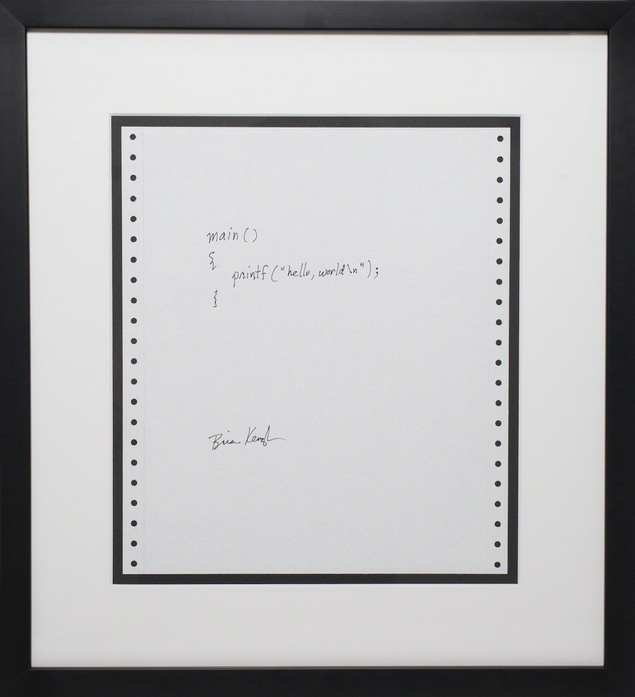

# hello, world



Let's start new programming language with ["hello, world"](https://en.wikipedia.org/wiki/%22Hello,_World!%22_program)!

## Supported Languages

2 language supported  

([C](#in-C) / [LLVM IR](#in-LLVM-IR) / [IchigoJam BASIC](#in-IchigoJam-BASIC))

## How to run

### in C

[main.c](main.c) in [C](https://en.wikipedia.org/wiki/C_(programming_language))
```c
#include <stdio.h>

int main() {
  printf("hello, world\n");
  return 0;
}
```

setup:
```bash
$ brew install llvm
```

to run:
```bash
$ clang main.c; ./a.out
```

### in LLVM-IR

[main.ll](main.ll) in [LLVM IR](https://llvm.org/docs/LangRef.html)
```
declare dso_local i32 @printf(ptr, ...)

@.str.mes = private unnamed_addr constant [14 x i8] c"hello, world\0a\00"

define dso_local i32 @main(i32 %argc, i8** %argv) {
  call i32 (ptr, ...) @printf(ptr @.str.mes)
  ret i32 0
}
```

setup:
```bash
$ brew install llvm
```

to run:
```bash
$ clang main.ll; ./a.out
```

### in C

[IchigoJam BASIC](https://ichigojam.net/)

setup:  
- open [IchigoJam web](https://fukuno.jig.jp/app/IchigoJam)

to run:
```
10 ?"hello, world"
RUN
```

## Related project

- [Geo3x3](https://github.com/taisukef/Geo3x3) supports over 100 languages
